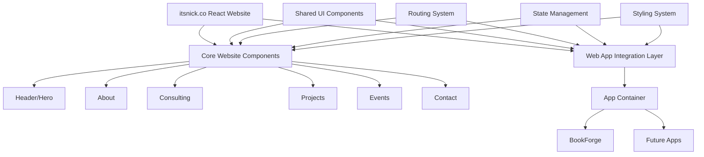
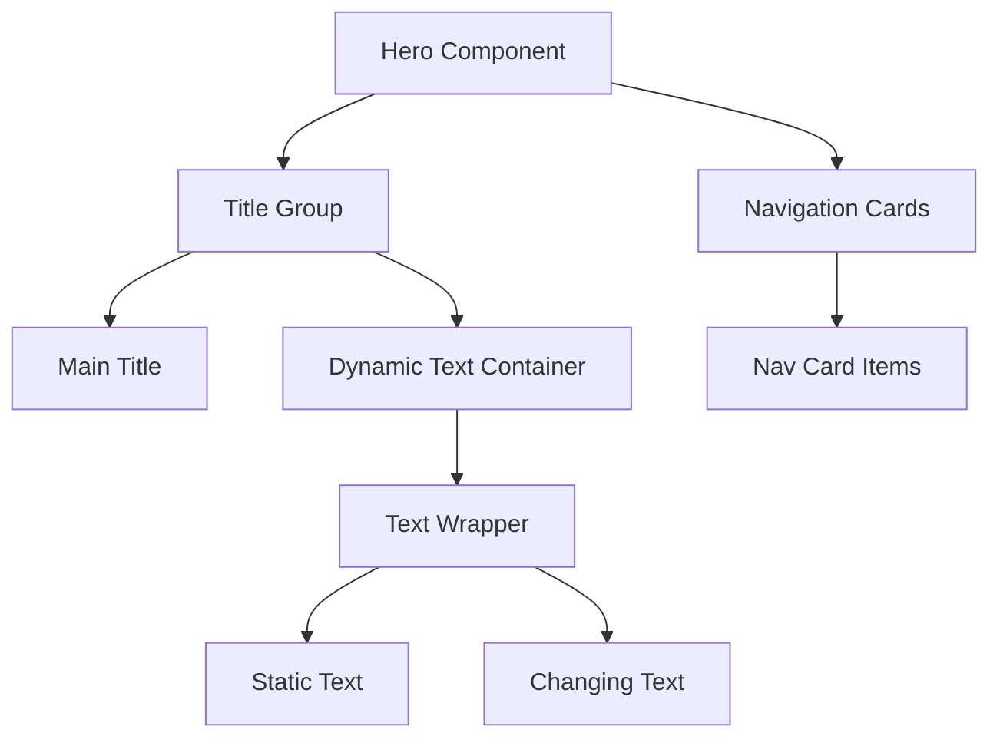
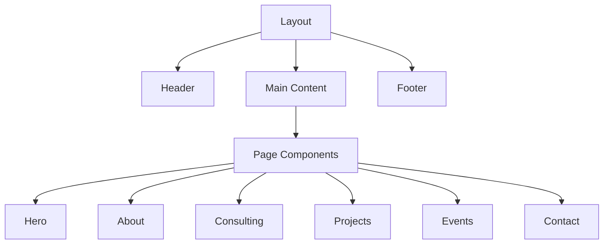
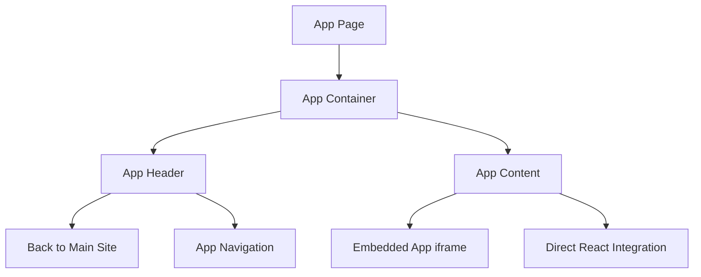
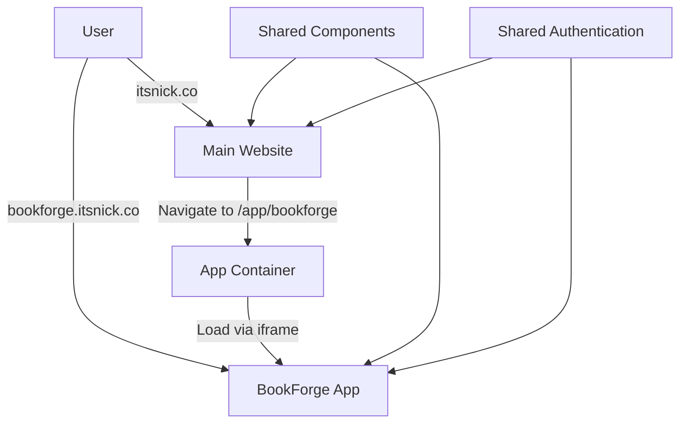

# Detailed Plan for itsnick.co React Website

This comprehensive plan outlines the development approach for the new React-based personal brand website for itsnick.co, incorporating a mustard and medium blue color scheme, preserving the hero section from the existing site, and allowing for web app integration.

## 1. Project Architecture Overview



## 2. Technical Stack

### Core Technologies
- **Framework**: React 18+ with functional components and hooks
- **Build Tool**: Vite (for faster development and optimized production builds)
- **Routing**: React Router v6 (for seamless navigation)
- **State Management**: React Context API for site-wide state, with local state using useState/useEffect
- **Styling**: CSS Modules or Styled Components with a custom theme
- **Deployment**: Vercel or Netlify (for easy deployment and preview features)

### Additional Libraries
- **Animation**: Framer Motion (for smooth transitions and animations)
- **Icons**: React Icons or Phosphor Icons
- **UI Components**: Custom components with accessibility in mind
- **Form Handling**: React Hook Form (for contact form)

## 3. Project Structure

```
personal-brand-website/
├── public/
│   ├── favicon.ico
│   ├── robots.txt
│   └── assets/
│       └── images/
├── src/
│   ├── components/
│   │   ├── layout/
│   │   │   ├── Header.jsx
│   │   │   ├── Footer.jsx
│   │   │   └── Layout.jsx
│   │   ├── hero/
│   │   │   ├── Hero.jsx
│   │   │   └── DynamicText.jsx
│   │   ├── sections/
│   │   │   ├── About.jsx
│   │   │   ├── Consulting.jsx
│   │   │   ├── Projects.jsx
│   │   │   ├── Events.jsx
│   │   │   └── Contact.jsx
│   │   ├── ui/
│   │   │   ├── Button.jsx
│   │   │   ├── Card.jsx
│   │   │   ├── NavLink.jsx
│   │   │   └── ProjectCard.jsx
│   │   └── app-container/
│   │       └── AppContainer.jsx
│   ├── pages/
│   │   ├── HomePage.jsx
│   │   ├── AboutPage.jsx
│   │   ├── ProjectsPage.jsx
│   │   ├── ConsultingPage.jsx
│   │   ├── EventsPage.jsx
│   │   ├── ContactPage.jsx
│   │   └── AppPage.jsx
│   ├── hooks/
│   │   ├── useScrollAnimation.js
│   │   └── useMediaQuery.js
│   ├── context/
│   │   └── ThemeContext.jsx
│   ├── styles/
│   │   ├── theme.js
│   │   ├── global.css
│   │   └── animations.js
│   ├── utils/
│   │   ├── animations.js
│   │   └── helpers.js
│   ├── data/
│   │   ├── projects.js
│   │   ├── events.js
│   │   └── interests.js
│   ├── App.jsx
│   ├── main.jsx
│   └── routes.jsx
├── .gitignore
├── package.json
├── vite.config.js
└── README.md
```

## 4. Design System

### Color Palette
```
Primary Colors:
- Mustard: #FFDB58 (from existing site)
- Medium Blue: #0057B8 (as requested)

Secondary Colors:
- Dark Blue: #1A1F2E (from existing site, for backgrounds)
- Light Gray: #F5F5F5 (for light sections)
- White: #FFFFFF (for text on dark backgrounds)

Accent Colors:
- Light Mustard: #FFE78A (for hover states)
- Dark Mustard: #E6C14F (for active states)
- Light Blue: #4D8FD6 (for hover states)
- Dark Blue: #004494 (for active states)
```

### Typography
```
Headings: 
- Font: Inter or Montserrat, Bold (700)
- Sizes: 
  - H1: 4.5rem (72px)
  - H2: 2.5rem (40px)
  - H3: 1.5rem (24px)

Body Text:
- Font: Inter, Regular (400)
- Size: 1rem (16px)
- Line Height: 1.6

Accents:
- Font: Inter, Medium (500)
- Size: Varies based on context
```

### Component Design
```
Buttons:
- Primary: Mustard background, Dark Blue text
- Secondary: Transparent with Mustard border, Mustard text
- Hover: Scale up slightly, shadow effect

Cards:
- Background: Subtle gradient or semi-transparent
- Border: Thin border or subtle shadow
- Hover: Slight elevation, border color change

Navigation:
- Desktop: Horizontal menu with hover effects
- Mobile: Hamburger menu with slide-in animation
```

## 5. Component Architecture

### Hero Section (Preserved from existing site)


### Core Page Structure


### App Integration


## 6. Key Features Implementation

### 1. Dynamic Hero Section
- Recreate the existing hero with the rotating interests text
- Implement using React hooks (useState, useEffect)
- Add smooth animations with Framer Motion
- Ensure responsive design for all devices

```jsx
// Example implementation of DynamicText component
const DynamicText = () => {
  const interests = [
    'Photography.',
    'AI.',
    'Machine Learning.',
    // ... other interests
  ];
  
  const [currentIndex, setCurrentIndex] = useState(0);
  
  useEffect(() => {
    const interval = setInterval(() => {
      setCurrentIndex(prevIndex => 
        prevIndex === interests.length - 1 ? 0 : prevIndex + 1
      );
    }, 3000);
    
    return () => clearInterval(interval);
  }, []);
  
  return (
    <div className="dynamic-text-container">
      <div className="text-wrapper">
        <span className="static-text">...and I'm into</span>
        <motion.span
          key={currentIndex}
          initial={{ opacity: 0 }}
          animate={{ opacity: 1 }}
          exit={{ opacity: 0 }}
          transition={{ duration: 0.5 }}
          className="accent"
        >
          {interests[currentIndex]}
        </motion.span>
      </div>
    </div>
  );
};
```

### 2. Responsive Navigation
- Implement a clean, modern navigation system
- Desktop: Horizontal menu with subtle animations
- Mobile: Hamburger menu with slide-out drawer
- Smooth scrolling to sections on the homepage

### 3. Projects Showcase
- Create a grid of project cards
- Each card includes image, title, description, and tags
- Filter functionality by category (Photography, AI, Woodworking, etc.)
- Modal or dedicated page for project details

### 4. Consulting Services
- Clear presentation of your service offerings
- Integration with calendar for booking consultations
- Pricing information (if applicable)
- Testimonials from previous clients

### 5. Events Section
- Display upcoming and past events
- Registration links for upcoming events
- Photo galleries from past events
- Integration with calendar for event scheduling

### 6. Web App Integration
- Create a flexible container for embedding web applications
- Two integration approaches:
  1. **iframe embedding**: For standalone apps with their own domains
  2. **Direct React integration**: For apps built as React components

```jsx
// Example AppContainer component
const AppContainer = ({ appId, title }) => {
  // Map of available apps
  const apps = {
    bookforge: {
      url: 'https://bookforge.itsnick.co',
      title: 'BookForge',
      description: 'Generate personalized books on any topic'
    },
    // Other apps can be added here
  };
  
  const app = apps[appId];
  
  if (!app) return <div>App not found</div>;
  
  return (
    <div className="app-container">
      <header className="app-header">
        <Link to="/" className="back-link">← Back to itsnick.co</Link>
        <h1>{app.title}</h1>
      </header>
      <div className="app-content">
        <iframe 
          src={app.url} 
          title={app.title}
          className="app-frame"
          allow="fullscreen"
        />
      </div>
    </div>
  );
};
```

## 7. Routing Strategy

```jsx
// Example routes.jsx
import { createBrowserRouter } from 'react-router-dom';
import Layout from './components/layout/Layout';
import HomePage from './pages/HomePage';
import AboutPage from './pages/AboutPage';
import ProjectsPage from './pages/ProjectsPage';
import ConsultingPage from './pages/ConsultingPage';
import EventsPage from './pages/EventsPage';
import ContactPage from './pages/ContactPage';
import AppPage from './pages/AppPage';

const router = createBrowserRouter([
  {
    path: '/',
    element: <Layout />,
    children: [
      { index: true, element: <HomePage /> },
      { path: 'about', element: <AboutPage /> },
      { path: 'projects', element: <ProjectsPage /> },
      { path: 'consulting', element: <ConsultingPage /> },
      { path: 'events', element: <EventsPage /> },
      { path: 'contact', element: <ContactPage /> },
    ]
  },
  {
    path: '/app/:appId',
    element: <AppPage />
  }
]);

export default router;
```

## 8. Animation Strategy

- **Page Transitions**: Smooth fade or slide transitions between pages
- **Scroll Animations**: Elements animate in as they enter the viewport
- **Hover Effects**: Subtle scale and color changes on interactive elements
- **Background Effects**: Recreate the glowing background effect from the existing site

```jsx
// Example useScrollAnimation hook
const useScrollAnimation = () => {
  const controls = useAnimation();
  const ref = useRef();
  
  useEffect(() => {
    const observer = new IntersectionObserver(
      ([entry]) => {
        if (entry.isIntersecting) {
          controls.start('visible');
        }
      },
      { threshold: 0.1 }
    );
    
    if (ref.current) {
      observer.observe(ref.current);
    }
    
    return () => {
      if (ref.current) {
        observer.unobserve(ref.current);
      }
    };
  }, [controls]);
  
  return [ref, controls];
};

// Usage in a component
const MyComponent = () => {
  const [ref, controls] = useScrollAnimation();
  
  return (
    <motion.div
      ref={ref}
      initial="hidden"
      animate={controls}
      variants={{
        hidden: { opacity: 0, y: 20 },
        visible: { opacity: 1, y: 0, transition: { duration: 0.6 } }
      }}
    >
      Content here
    </motion.div>
  );
};
```

## 9. Implementation Roadmap

### Phase 1: Project Setup and Core Structure (Week 1)
- Set up project with Vite and React
- Configure routing with React Router
- Implement basic layout components
- Set up styling system with theme variables
- Create responsive navigation

### Phase 2: Hero and About Sections (Week 1-2)
- Implement hero section with dynamic text rotation
- Create about section with your bio and journey
- Implement scroll animations
- Ensure responsive design

### Phase 3: Projects and Consulting Sections (Week 2)
- Create projects grid with filtering
- Implement project detail views
- Build consulting services section
- Add calendar integration for bookings

### Phase 4: Events and Contact Sections (Week 3)
- Implement events listing with past/upcoming toggle
- Create contact form with validation
- Add social media links
- Implement form submission functionality

### Phase 5: Web App Integration (Week 3-4)
- Create app container component
- Implement routing for embedded apps
- Test with BookForge integration
- Create documentation for adding future apps

### Phase 6: Testing and Optimization (Week 4)
- Cross-browser testing
- Mobile responsiveness testing
- Performance optimization
- SEO implementation

### Phase 7: Deployment and Launch (Week 4)
- Set up deployment pipeline
- Configure domain and DNS
- Final testing in production environment
- Launch website

## 10. Web App Integration Strategy

To accommodate applications like BookForge while maintaining a cohesive brand experience, we'll implement a flexible integration approach:

### Option 1: Subdomain Approach
- Each app gets its own subdomain (e.g., bookforge.itsnick.co)
- Apps can be completely separate codebases
- Shared header/footer for brand consistency
- Navigation links back to main site

### Option 2: Path-Based Integration
- Apps accessible via paths (e.g., itsnick.co/app/bookforge)
- React Router handles routing to the app container
- App container loads the appropriate application
- Can be implemented via iframes or direct React component integration

### Option 3: Hybrid Approach (Recommended)
- Apps have both subdomain access and path-based integration
- Users can access directly via subdomain for standalone use
- Path-based integration for seamless experience from main site
- Shared authentication and user data where appropriate



## 11. Future Expansion Considerations

- **Blog Integration**: While skipping for now, the architecture will support adding a blog later
- **Additional Web Apps**: The app container is designed to easily add new applications
- **E-commerce**: Structure allows for adding product sales if needed in the future
- **Community Features**: Could add forums or community sections later
- **Analytics**: Will include hooks for adding detailed analytics